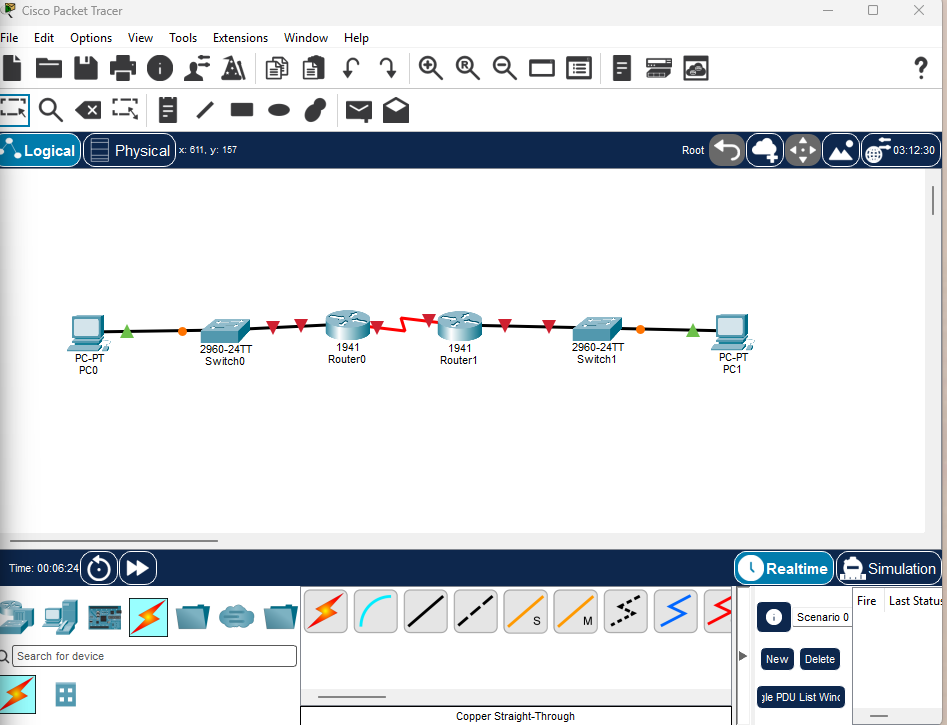
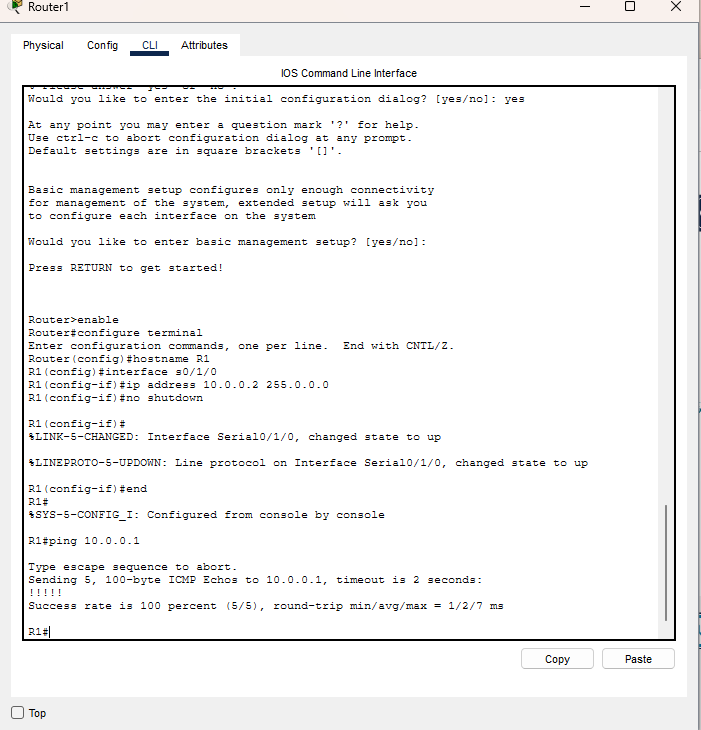
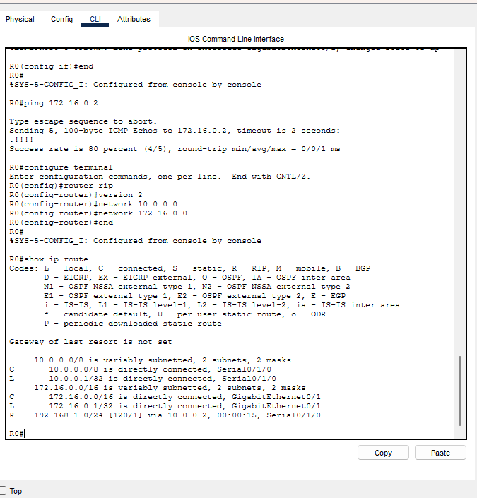
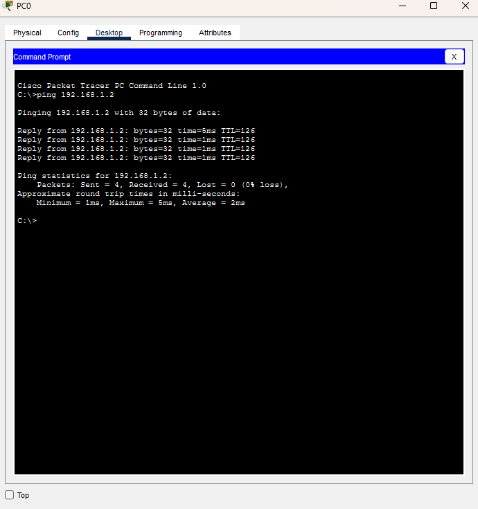
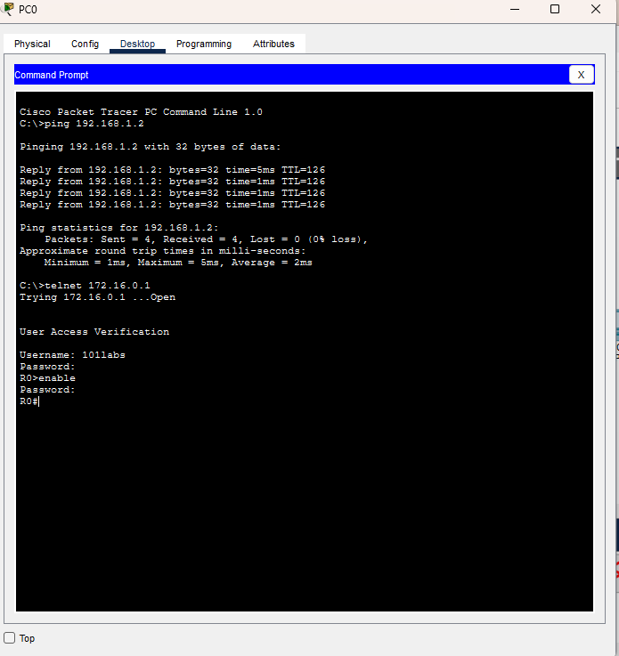

# Cisco Router Configuration & RIP v2 Lab

## Overview

This Cisco Packet Tracer lab demonstrates the configuration of a routed network consisting of two Cisco routers, two switches, and two PCs.

The lab includes router interface configuration, WAN serial connectivity, IP addressing, RIP v2 dynamic routing, routing table verification, end-to-end connectivity testing, and remote router management using Telnet.

## Lab Objectives

- Configure Cisco router interfaces using the IOS CLI
- Assign IPv4 addresses and subnet masks
- Configure default gateways for end devices
- Establish a serial WAN connection between two routers
- Identify DCE/DTE serial interfaces
- Configure RIP version 2 dynamic routing
- Verify learned routes using the routing table
- Test local and remote network connectivity
- Configure VTY lines for remote router access
- Test Telnet connectivity from an end-user device

## Network Topology

The lab consists of:

- 2 Cisco 1941 Routers
- 2 Cisco 2960 Switches
- 2 PCs
- 1 Serial WAN connection
- 2 Local Area Networks

### Topology

PC0 → Switch0 → Router0 → Router1 → Switch1 → PC1



## IP Addressing

| Device | Interface | IP Address | Subnet Mask | Default Gateway |
|---|---|---|---|---|
| Router0 | G0/1 | 172.16.0.1 | 255.255.0.0 | N/A |
| Router0 | S0/1/0 | 10.0.0.1 | 255.0.0.0 | N/A |
| Router1 | S0/1/0 | 10.0.0.2 | 255.0.0.0 | N/A |
| Router1 | G0/0 | 192.168.1.1 | 255.255.255.0 | N/A |
| PC0 | FastEthernet0 | 172.16.0.2 | 255.255.0.0 | 172.16.0.1 |
| PC1 | FastEthernet0 | 192.168.1.2 | 255.255.255.0 | 192.168.1.1 |

## Router Interface Configuration

Router interfaces were configured manually using the Cisco IOS CLI.

Example LAN interface configuration:

```text
interface GigabitEthernet0/1
ip address 172.16.0.1 255.255.0.0
no shutdown
```

The serial interfaces connecting Router0 and Router1 were configured on the `10.0.0.0` network.

The DCE side of the serial connection was identified using:

```text
show controllers s0/1/0
```

## WAN Connectivity Verification

Connectivity between Router0 and Router1 was tested across the serial WAN link.

Router1 successfully reached Router0 at:

```text
10.0.0.1
```

The test completed with a 100% success rate.



## RIP v2 Dynamic Routing

RIP version 2 was configured on both routers so each router could dynamically learn the remote LAN.

### Router0

```text
router rip
version 2
network 10.0.0.0
network 172.16.0.0
```

### Router1

```text
router rip
version 2
network 10.0.0.0
network 192.168.1.0
```

## Routing Table Verification

The routing table on Router0 was verified using:

```text
show ip route
```

Router0 successfully learned the `192.168.1.0/24` network through RIP.

Example learned route:

```text
R 192.168.1.0/24 [120/1] via 10.0.0.2
```



## End-to-End Connectivity Test

PC0 was used to test connectivity across both routers to PC1.

```text
ping 192.168.1.2
```

Results:

- Packets Sent: 4
- Packets Received: 4
- Packet Loss: 0%

This confirmed successful communication between the two separate LANs through the routed WAN connection.



## Remote Router Management

VTY lines were configured on Router0 to allow remote management through Telnet.

The configuration included:

- Local user authentication
- VTY line configuration
- Telnet access
- Privileged EXEC access

Example configuration:

```text
enable secret hello
username 101labs password cisco
line vty 0 15
transport input telnet
login local
```

PC0 successfully established a Telnet connection to Router0 at:

```text
172.16.0.1
```

The connection was authenticated successfully and privileged EXEC mode was accessed.



> **Security Note:** Telnet was used because it was part of the lab exercise. Telnet transmits traffic in plaintext and would normally be replaced with SSH for secure remote administration in a production environment.

## Commands Used

Key Cisco IOS commands practiced during this lab include:

```text
enable
configure terminal
hostname
interface
ip address
no shutdown
show ip interface brief
show controllers
ping
router rip
version 2
network
show ip route
enable secret
username
line vty
transport input telnet
login local
```

## Skills Demonstrated

- Cisco Router Configuration
- Cisco IOS CLI
- Router Interface Configuration
- IPv4 Addressing
- IP Addressing and Subnetting
- Default Gateway Configuration
- WAN Serial Link Configuration
- DCE/DTE Serial Interface Identification
- RIP v2 Dynamic Routing
- Routing Table Verification
- End-to-End Network Connectivity Testing
- Cisco VTY Line Configuration
- Remote Router Management
- Telnet Configuration and Testing
- Network Troubleshooting
- ICMP Connectivity Testing
- Cisco Packet Tracer

## Key Takeaways

This lab provided hands-on experience building and configuring a multi-network Cisco environment.

I configured LAN and WAN interfaces, established communication between two routers, implemented RIP v2 dynamic routing, verified learned routes, tested end-to-end connectivity between separate networks, and configured remote router administration.

The completed network successfully allowed PC0 on the `172.16.0.0/16` network to communicate with PC1 on the `192.168.1.0/24` network through two Cisco routers.

## Lab Environment

- Cisco Packet Tracer
- Cisco 1941 Routers
- Cisco 2960 Switches
- Cisco IOS CLI

---

This project was completed as part of hands-on networking and cybersecurity skills development.
